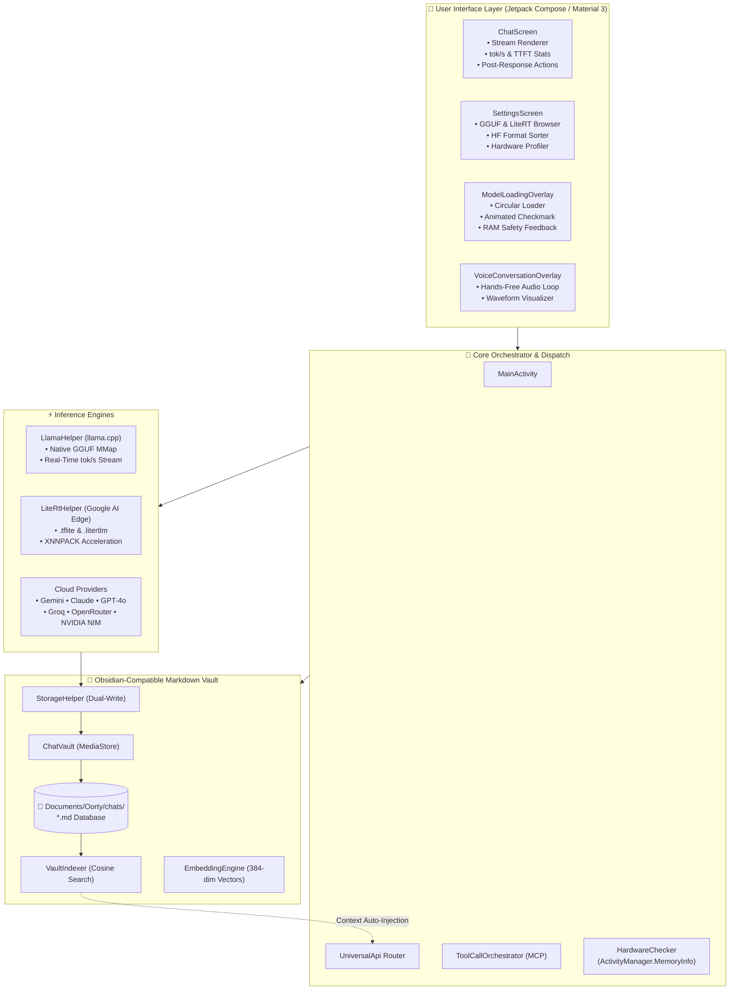

<div align="center">
#  Oorty by Sednium (v2.0)

### *Multi-Model AI Chat, Dual On-Device Neural Inference (GGUF & LiteRT), Live Voice Mode & Autonomous Agentic Workspace*

[](https://github.com/Sednium-Technologies/OORTY/releases)
[](https://oorty.sednium.com)
[](https://sednium.com)
[](https://github.com/Sednium-Technologies/OORTY)
[](https://kotlinlang.org)
[](https://developer.android.com/jetpack/compose)
[](LICENSE)

<br />

**Oorty** is a warm, editorial-styled AI orchestrator that unifies **on-device native neural inference** (GGUF via llama.cpp and LiteRT via Google AI Edge), **autonomous Model Context Protocol (MCP) agentic workflows**, **hands-free live voice conversations**, **hybrid semantic memory recall**, and **direct Obsidian-compatible Markdown knowledge bases** into a native Android app and web interface.

<br />

```
  ┌────────────────────────────────────────────────────────────────────────┐
  │  🥛 Milk White (#FDFBF7)  │  🍊 Burnt Orange (#EC5E27)  │  🖋️ Source Serif 4  │
  └────────────────────────────────────────────────────────────────────────┘
```

</div>

---

## 📑 Table of Contents

- [🎉 What's New in v2.0 (Changelog)](#-whats-new-in-v20-changelog)
- [🌟 Architectural Highlights](#-architectural-highlights)
- [🏗️ System Architecture](#️-system-architecture)
- [🚀 Key Capabilities](#-key-capabilities)
  - [1. Zero-Mock Dual On-Device Engine (GGUF & LiteRT)](#1-zero-mock-dual-on-device-engine-gguf--litert)
  - [2. Thinking Mode (Reasoning vs. Response Separation)](#2-thinking-mode-reasoning-vs-response-separation)
  - [3. Modernized UI/UX, Pill Composer & Lucide Icons](#3-modernized-uiux-pill-composer--lucide-icons)
  - [4. Live Hands-Free Voice Mode & Real-Time STT](#4-live-hands-free-voice-mode--real-time-stt)
  - [5. Post-Response Action Toolbar & Branching](#5-post-response-action-toolbar--branching)
  - [6. Obsidian-Compatible Markdown Vault (`Documents/Oorty/`)](#6-obsidian-compatible-markdown-vault-documentsoorty)
  - [7. Dynamic RAM Watchdog & Loading Overlay](#7-dynamic-ram-watchdog--loading-overlay)
  - [8. Autonomous MCP Framework & Device Tools](#8-autonomous-mcp-framework--device-tools)
  - [9. Multi-Provider Cloud Orchestration](#9-multi-provider-cloud-orchestration)
- [📱 Hardware Fit & RAM Recommendation Matrix](#-hardware-fit--ram-recommendation-matrix)
- [📂 Repository Structure](#-repository-structure)
- [🛠️ Getting Started (Local Development)](#️-getting-started-local-development)
  - [Prerequisites](#prerequisites)
  - [Building & Installing the Android App](#building--installing-the-android-app)
  - [Running the Unit & E2E Test Suites](#running-the-unit--e2e-test-suites)
  - [Running the Landing Page](#running-the-landing-page)
- [⚙️ Configuration & Secrets](#️-configuration--secrets)
- [🧪 Testing & Quality Assurance](#-testing--quality-assurance)
- [📖 Connecting Oorty to Obsidian](#-connecting-oorty-to-obsidian)
- [🔧 Troubleshooting & Diagnostics](#-troubleshooting--diagnostics)
- [📄 License & Credits](#-license--credits)

---

## 🎉 What's New in v2.0 (Changelog)

### 🧠 1. Dual On-Device Inference (Zero-Mock Native GGUF + Google AI Edge LiteRT)
- **Eliminated All Canned Mocks**: Completely replaced reflection fallbacks with direct, native bindings to `org.nehuatl.llamacpp.LlamaHelper`, streaming real tokens directly from memory-mapped `.gguf` weights.
- **Added Google AI Edge LiteRT Engine**: Introduced `LiteRtHelper` utilizing `com.google.ai.edge.litert:litert:2.1.0` with XNNPACK hardware acceleration and automatic thread pooling for `.tflite` and `.litertlm` models.
- **Hugging Face Hub Format Sorter**: Integrated format filter chips (**All Models**, **GGUF (llama.cpp)**, **LiteRT (Google AI Edge)**) and format badges on model cards with curated LiteRT SLMs (Gemma 2 2B, MobileBERT, GOT-OCR).
- **Full-Screen Loading Overlay**: Fixed state lifecycle so `ModelLoadingOverlay` shows actual RAM verification, loading progress, and a 1.5-second success checkmark delay rather than unmounting instantaneously.

### 🎨 2. UI/UX Modernization & Design Craft
- **Thinking Mode Separation**: Upgraded `StreamingThoughtParser` to cleanly split `<thought>` chains from final answers. Collapsible thought block preserves reasoning time and token count without polluting or truncating final responses.
- **Lucide Outline Icon Family**: Modernized the entire app's iconography with a cohesive, uniform stroke-weight icon system (`LucideIcons.kt`).
- **Pill-Shaped Message Composer**: Rebuilt composer with true pill radius, plus icon for attachment/tool tray, live speech-to-text mic, and up-arrow send button.
- **Live Hands-Free Voice Mode**: Added a dedicated hands-free conversation overlay (`LiveModeOverlay` / `VoiceConversationOverlay`) with real-time waveform visualization.
- **Clean Borderless AI Responses**: Removed card containers for assistant messages—text renders directly on the warm editorial background.
- **Post-Response Action Toolbar**: Added quick actions beneath every assistant message: Copy, Share, Branch Chat, Send to Another Model, Read Aloud (TTS), and Regenerate.
- **User Prompt Editing**: Support for long-press editing of user messages with automatic downstream regeneration.
- **Rich Media Viewers**: Native Compose views for AI-generated images (`ImageResultView`), audio (`AudioResultView`), and video (`VideoResultView`).

### 🛠️ 3. Agentic MCP & Extensibility
- **Device Tools**: Added native device tool executions (`DeviceTools.kt`) for MCP agents (app launching, status querying, system notifications).
- **Plugin Architecture**: Added a multi-category plugin subsystem with a user-friendly onboarding flow (`PluginOnboardingScreen.kt`).

---

## 🌟 Architectural Highlights

<table>
  <tr>
    <td width="50%">
      <h3>🔒 Zero-Mock On-Device AI</h3>
      <p>Run open-weights models (<b>Qwen 2.5</b>, <b>Llama 3.2</b>, <b>Phi-3 Mini</b>, <b>Gemma 2</b>) 100% offline via native GGUF and Google AI Edge LiteRT with real-time tok/s telemetry.</p>
    </td>
    <td width="50%">
      <h3>📝 Obsidian-Native Vault</h3>
      <p>Chats are dual-written to public storage (<code>Documents/Oorty/</code>) as clean Markdown notes with YAML frontmatter, timestamps, estimated tokens, and topic tags.</p>
    </td>
  </tr>
  <tr>
    <td width="50%">
      <h3>🎙️ Live Voice Mode</h3>
      <p>Hands-free continuous voice interaction with real-time listening, thinking, and speaking state feedback with audio waveforms.</p>
    </td>
    <td width="50%">
      <h3>🛠️ Autonomous MCP Agent</h3>
      <p>Model Context Protocol (MCP) tool execution loop supporting cloud flagships, local SLMs, device tools, and custom plugins.</p>
    </td>
  </tr>
</table>

---

## 🏗️ System Architecture



---

## 🚀 Key Capabilities

### 1. Zero-Mock Dual On-Device Engine (GGUF & LiteRT)

Oorty features zero-cloud fallback capability by utilizing native `llama.cpp` and Google AI Edge LiteRT:
- **Streaming Output**: Token-by-token streaming via Kotlin Coroutines `SharedFlow<LLMEvent>`.
- **Zero Mocks**: All canned mock responses removed; genuine native execution only.
- **Telemetry**: Measures real-time tokens per second (`tok/s`) and Time-to-First-Token (`TTFT`).
- **Persistent Storage Access (SAF)**: Utilizes `takePersistableUriPermission` to retain access to user-selected model weights across device reboots.
- **Hardware Acceleration**: Automatic multi-threading and XNNPACK delegate enablement.

---

### 2. Thinking Mode (Reasoning vs. Response Separation)

Oorty separates model reasoning from final answers:
- **Dedicated Reasoning Parser**: Detects `<thought>` or `<think>` tags in real-time.
- **Collapsible UI**: Thoughts collapse neatly into a "Thought Process" block showing elapsed thinking time.
- **Clean Message History**: Only clean final answers populate chat cards, vault notes, and TTS readers.

---

### 3. Modernized UI/UX, Pill Composer & Lucide Icons

- **True Pill Composer**: Built with a dedicated pill radius, integrated attachment drawer (`+`), live voice dictation mic, and send up-arrow.
- **Unified Lucide Icons**: Consistent, high-craft outline iconography across all dialogs and screens.
- **Borderless AI Responses**: Clean editorial aesthetic where assistant responses blend naturally with the background.

---

### 4. Live Hands-Free Voice Mode & Real-Time STT

- **Continuous Voice Loop**: Speak naturally with automatic voice activity detection, real-time transcription, and immediate audio playback.
- **Fluid Waveform Overlay**: Visual feedback for listening, thinking, and speaking states.

---

### 5. Post-Response Action Toolbar & Branching

- **Copy & Share**: Immediate one-tap copying and system sharing.
- **Branch Chat**: Fork a new discussion thread from any point in the conversation history.
- **Send to Another Model**: Compare answers side-by-side across different providers.
- **Read Aloud**: Native text-to-speech engine playback.
- **Prompt Editing**: Tap and edit prior user messages with automatic downstream regeneration.

---

### 6. Obsidian-Compatible Markdown Vault (`Documents/Oorty/`)

Every chat session is preserved as an open Markdown file in `Documents/Oorty/chats/`:
- **Obsidian-Ready**: Open `Documents/Oorty/` directly as an Obsidian Vault.
- **Structured YAML Frontmatter**: Includes `id`, `title`, `created`, `updated`, `model`, `provider`, `total_tokens_est`, `tags`, and `message_count`.
- **Granular Message Headers**: Formatted with timestamps, estimated token usage, and latency.

---

### 7. Dynamic RAM Watchdog & Loading Overlay

- **Pre-Load Safety Audit**: Compares model file size against real-time available memory.
- **Safety Categories**:
  - 🟢 **Comfortable Fit** (< 55% free RAM): Smooth operation.
  - 🟠 **Tight Fit** (55%–85% free RAM): Warning advisory.
  - 🔴 **High Crash Risk** (> 85% free RAM): Prompts user to choose a lighter quantization.
- **Full-Screen Feedback**: Shows memory stats, loading progress bar, and 1.5s success confirmation.

---

### 8. Autonomous MCP Framework & Device Tools

- **Model Context Protocol (MCP)**: Run multi-step tool calls with local and remote servers.
- **Device Tools**: Direct mobile capabilities including app launching and system info queries.
- **Plugin Architecture**: Modular, extensible toolsets with guided setup.

---

### 9. Multi-Provider Cloud Orchestration

Connect to leading cloud AI providers with your own API keys:
- 🔵 **Google Gemini** (Gemini 2.5 Flash, Gemini 2.5 Pro, Flash Thinking)
- 🟣 **Anthropic** (Claude 3.5 Sonnet, Claude 3.7 Sonnet)
- 🟢 **OpenAI** (GPT-4o, GPT-4o-mini, o1, o3-mini)
- ⚡ **Groq** (Llama 3.3 70B, DeepSeek R1 Distill)
- 🌌 **OpenRouter** (200+ models)
- 🟢 **NVIDIA NIM** (Nemotron 70B, Cosmos, NV-Embed)
- 🔴 **xAI** (Grok 2, Grok Beta)

---

## 📱 Hardware Fit & RAM Recommendation Matrix

| Device RAM | Recommended Local Model | Format | Est. Model RAM | Agentic Support |
| :--- | :--- | :--- | :--- | :--- |
| **4 GB RAM** | `Qwen2.5-0.5B-Instruct` | GGUF (Q4_K_M) | ~450 MB | ⚡ Basic |
| **6 GB RAM** | `Llama-3.2-1B-Instruct` | GGUF (Q4_K_M) | ~850 MB | ⚡ Fast |
| **8 GB RAM** | `Gemma-2-2B-IT` | GGUF / LiteRT | ~1.6 GB | ✅ Moderate |
| **12 GB+ RAM** | `Phi-3-mini-4k` / `Llama-3.1-8B` | GGUF (Q4_K_M) | ~2.4 – 4.8 GB | 🚀 Full Autonomous |

---

## 📂 Repository Structure

```text
Oorty/
├── app/                               # Native Android Application
│   ├── app/
│   │   ├── src/
│   │   │   ├── main/
│   │   │   │   ├── java/oorty/sednium/app/
│   │   │   │   │   ├── api/           # LlamaHelper, LiteRtHelper, UniversalApi, HuggingFaceApi
│   │   │   │   │   ├── model/         # Models, ChatSession, AppSettings, ProviderConfig
│   │   │   │   │   ├── mcp/           # ToolCallOrchestrator, DeviceTools, LocalGgufToolChatClient
│   │   │   │   │   ├── plugins/       # Extensible Plugin Architecture & Providers
│   │   │   │   │   ├── vault/         # ChatVault, EmbeddingEngine, VaultIndexer
│   │   │   │   │   ├── util/          # HardwareChecker (RAM detection & safe fallbacks)
│   │   │   │   │   ├── ui/            # Jetpack Compose UI
│   │   │   │   │   │   ├── screens/   # ChatScreen, SettingsScreen, PromptLabScreen, ChatListScreen
│   │   │   │   │   │   ├── components/# ModelLoadingOverlay, MessageComposer, LiveModeOverlay
│   │   │   │   │   │   └── theme/     # SedniumColors, LucideIcons, Typography, Shape
│   │   │   │   │   └── MainActivity.kt# Root Application Coordinator
│   │   │   │   └── AndroidManifest.xml# Permissions, largeHeap, providers
│   │   │   └── test/                  # Automated Test Suites
│   │   │       └── java/oorty/sednium/app/
│   │   │           ├── api/           # LocalEngineZeroMockTests.kt (Zero-mock verification)
│   │   │           ├── vault/         # VaultAndLocalModelTests.kt (Vault & recall tests)
│   │   │           └── e2e/           # Tier1FeatureTests.kt (End-to-end flow tests)
│   │   └── build.gradle.kts           # Kotlin 2.2, Compose M3, LiteRT, llamacpp AARs
│   └── gradle/                        # Gradle Wrapper & Version Catalogs
├── website/                           # Web Landing Page & Hosted Client
├── TASKS.md                           # Development Milestones & Task Tracker
├── UI_REVAMP.md                       # UI/UX Revamp Specification
├── PROJECT.md                         # Master Architecture Blueprint
└── README.md                          # Documentation & Quickstart
```

---

## 🛠️ Getting Started (Local Development)

### Prerequisites

- **Android Studio Ladybug (2024.2+)** or command-line Gradle.
- **JDK 17 or JDK 21**.
- **Android SDK Platform 35/36** with Build-Tools `35.0.0+`.
- Physical Android Device (Android 8.0+ / API 26+) or Android Emulator.

---

### Building & Installing the Android App

1. **Clone the repository:**
   ```bash
   git clone https://github.com/Sednium-Technologies/OORTY.git
   cd OORTY/app
   ```

2. **Assemble the Debug APK:**
   ```bash
   ./gradlew assembleDebug
   ```
   *Output binary:* `app/app/build/outputs/apk/debug/app-debug.apk` (~90 MB with all native `.so` libraries).

3. **Install on Connected Device via ADB:**
   ```bash
   adb install -r app/app/build/outputs/apk/debug/app-debug.apk
   ```

4. **Launch Application:**
   ```bash
   adb shell am start -n oorty.sednium.app/.MainActivity
   ```

---

### Running the Unit & E2E Test Suites

```bash
# Run all local JVM Robolectric unit tests
./gradlew :app:testDebugUnitTest

# Verify zero-mock local inference engines (GGUF & LiteRT)
./gradlew :app:testDebugUnitTest --tests "oorty.sednium.app.api.LocalEngineZeroMockTests"

# Verify Vault storage, semantic recall & hardware profiler
./gradlew :app:testDebugUnitTest --tests "oorty.sednium.app.vault.VaultAndLocalModelTests"
```

---

### Running the Landing Page

```bash
cd website
python3 -m http.server 8000
# Open http://localhost:8000 in your browser
```

---

## ⚙️ Configuration & Secrets

API keys are encrypted and stored in local Android private storage, or configured via `.env`:

| Variable | Provider / Feature | Description |
| :--- | :--- | :--- |
| `GOOGLE_API_KEY` | Google Gemini | API Key from Google AI Studio |
| `ANTHROPIC_API_KEY` | Anthropic Claude | API Key from Anthropic Console |
| `OPENAI_API_KEY` | OpenAI | API Key from OpenAI Platform |
| `GROQ_API_KEY` | Groq | Ultra-low latency Llama 3 inference |
| `OPENROUTER_API_KEY` | OpenRouter | Multi-model routing key |
| `NVIDIA_API_KEY` | NVIDIA NIM | Key from build.nvidia.com |
| `XAI_API_KEY` | xAI Grok | Key from x.ai console |

*(Note: Local GGUF and Local LiteRT inference requires **zero** API keys or accounts.)*

---

## 📖 Connecting Oorty to Obsidian

1. Open the **Obsidian Mobile App** on your Android device.
2. Tap **"Open folder as vault"**.
3. Select **`Documents/Oorty/`**.
4. Grant storage permissions.
5. All your chats will render with clickable tags, metadata frontmatter, code blocks, and timestamps.

---

## 🔧 Troubleshooting & Diagnostics

<details>
<summary><b>1. Model fails to load or app freezes during GGUF loading</b></summary>

- **Cause**: Out-of-memory or thermal throttling on high parameter models.
- **Fix**: Check `HardwareWarningDialog`. Choose a 4-bit quantized model (`Q4_K_M`) under 1.5GB (e.g., `Qwen2.5-0.5B` or `Llama-3.2-1B`).
</details>

<details>
<summary><b>2. "Permission Denied" when reading selected model file</b></summary>

- **Cause**: Android Storage Access Framework (SAF) URI expired.
- **Fix**: Oorty automatically calls `takePersistableUriPermission`. If files are moved in external file managers, re-select the model in **Settings > Model Settings**.
</details>

<details>
<summary><b>3. LiteRT models failing on custom hardware</b></summary>

- **Cause**: Incompatible delegate execution on older NPU/DSP chips.
- **Fix**: `LiteRtHelper` automatically detects delegate failures and falls back smoothly to multi-threaded CPU execution with XNNPACK acceleration.
</details>

---

## 📄 License & Credits

- **Publisher**: [Sednium](https://sednium.com)
- **Author / Lead Engineer**: [CoderBhoid](https://github.com/CoderBhoid)
- **License**: [MIT License](LICENSE)
- **Design Tokens**: Warm Editorial `#FDFBF7` Milk White & `#EC5E27` Sednium Orange.

<div align="center">
  <sub>Built with craft and precision by Sednium. Engineered for the future of on-device intelligence.</sub>
</div>
