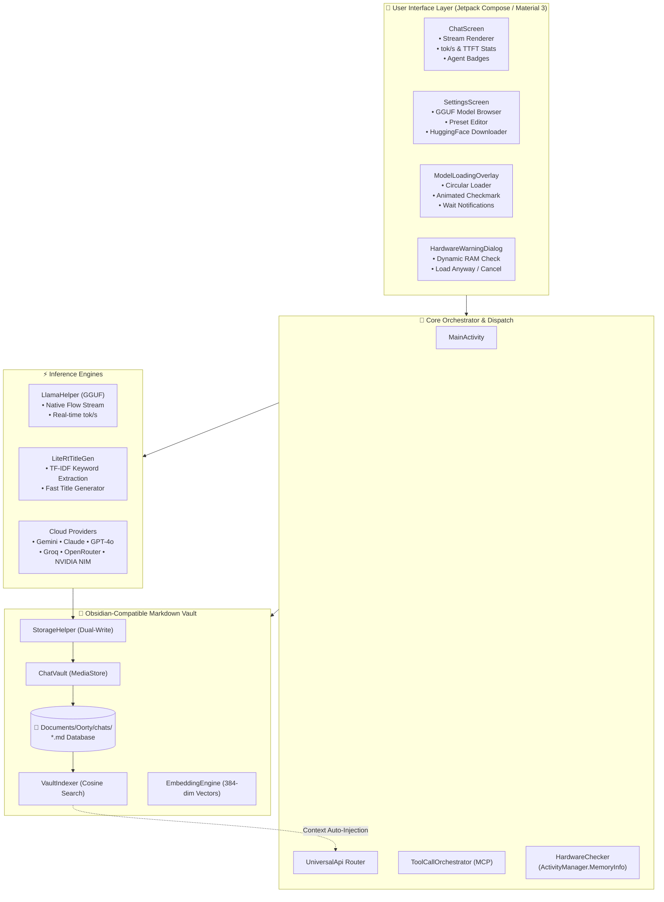

<div align="center">
# 🍊 Oorty by Sednium

### *Multi-Model AI Chat, Local GGUF Inference & Autonomous Agentic Workspace*

[](https://oorty.sednium.com)
[](https://sednium.com)
[](https://github.com/CoderBhoid/oorty-landing)
[](https://kotlinlang.org)
[](https://developer.android.com/jetpack/compose)
[](LICENSE)

<br />

**Oorty** is a warm, editorial-styled AI orchestrator that unifies **on-device native neural inference** (GGUF & LiteRT), **autonomous Model Context Protocol (MCP) agentic workflows**, **hybrid semantic memory recall**, and **direct Obsidian-compatible Markdown knowledge bases** into a single native Android app and web interface.

<br />

```
  ┌────────────────────────────────────────────────────────────────────────┐
  │  🥛 Milk White (#FDFBF7)  │  🍊 Burnt Orange (#EC5E27)  │  🖋️ Source Serif 4  │
  └────────────────────────────────────────────────────────────────────────┘
```

</div>

---

## 📑 Table of Contents

- [🌟 Architectural Highlights](#-architectural-highlights)
- [🏗️ System Architecture](#️-system-architecture)
- [🚀 Key Capabilities](#-key-capabilities)
  - [1. Native On-Device GGUF & LiteRT Engine](#1-native-on-device-gguf--litert-engine)
  - [2. Obsidian-Compatible Markdown Vault (`Documents/Oorty/`)](#2-obsidian-compatible-markdown-vault-documentsoorty)
  - [3. Dynamic RAM Watchdog & Hardware Safety](#3-dynamic-ram-watchdog--hardware-safety)
  - [4. Hybrid Semantic Memory Recall](#4-hybrid-semantic-memory-recall)
  - [5. Autonomous MCP Tool-Calling Framework](#5-autonomous-mcp-tool-calling-framework)
  - [6. Multi-Provider Cloud Orchestration](#6-multi-provider-cloud-orchestration)
- [📱 Hardware Fit & RAM Recommendation Matrix](#-hardware-fit--ram-recommendation-matrix)
- [📂 Repository Structure](#-repository-structure)
- [🛠️ Getting Started (Local Development)](#️-getting-started-local-development)
  - [Prerequisites](#prerequisites)
  - [Building the Android App](#building-the-android-app)
  - [Running on Termux (On-Device Local Server)](#running-on-termux-on-device-local-server)
  - [Running the Landing Page](#running-the-landing-page)
- [⚙️ Configuration & Secrets](#️-configuration--secrets)
- [🧪 Testing & Quality Assurance](#-testing--quality-assurance)
- [📖 Connecting Oorty to Obsidian](#-connecting-oorty-to-obsidian)
- [🔧 Troubleshooting & Diagnostics](#-troubleshooting--diagnostics)
- [📄 License & Credits](#-license--credits)

---

## 🌟 Architectural Highlights

<table>
  <tr>
    <td width="50%">
      <h3>🔒 Privacy-First Native AI</h3>
      <p>Run open-weights models (<b>Qwen 2.5</b>, <b>Llama 3.2</b>, <b>Phi-3 Mini</b>, <b>Gemma 2</b>) 100% offline via native GGUF engine with real-time tokens/sec telemetry.</p>
    </td>
    <td width="50%">
      <h3>📝 Obsidian-Native Vault</h3>
      <p>Chats are dual-written to public storage as clean <code>.md</code> notes with YAML frontmatter, timestamps, estimated tokens, and topic tags.</p>
    </td>
  </tr>
  <tr>
    <td width="50%">
      <h3>🧠 Hybrid Semantic Recall</h3>
      <p>384-dimensional dense semantic vectors compute cosine similarity to passively inject relevant past discussions into the AI's memory before every prompt.</p>
    </td>
    <td width="50%">
      <h3>🛠️ MCP Autonomous Agent</h3>
      <p>Model Context Protocol (MCP) tool-calling execution loop with support for both cloud models and small on-device quantized models.</p>
    </td>
  </tr>
</table>

---

## 🏗️ System Architecture



---

## 🚀 Key Capabilities

### 1. Native On-Device GGUF & LiteRT Engine

Oorty features zero-cloud fallback capability by utilizing `llamacpp-kotlin` and Google LiteRT:
- **Streaming Output**: Token-by-token streaming via Kotlin Coroutines `Flow<String>`.
- **Telemetry**: Measures real-time tokens per second (tok/s) and Time-to-First-Token (TTFT).
- **Persistent Storage Access (SAF)**: Utilizes `takePersistableUriPermission` to retain access to user-selected GGUF files across device reboots.
- **Title Generation**: Embedded TF-IDF keyword extraction generates clean, concise conversation titles in <10ms without consuming GPU memory.

<details>
<summary><b>🔍 View GGUF Provider Code Sample</b></summary>

```kotlin
// Streaming directly from on-device GGUF memory
val helper = LlamaHelper(context = applicationContext, uri = ggufUri)
helper.generateStream(
    prompt = "Explain coroutine dispatchers in Kotlin",
    systemInstruction = settings.currentSystemInstruction
).collect { tokenChunk ->
    chatViewModel.appendToken(tokenChunk)
}
```
</details>

---

### 2. Obsidian-Compatible Markdown Vault (`Documents/Oorty/`)

Every chat session is preserved as an open Markdown file in `Documents/Oorty/chats/`:
- **Obsidian-Ready**: Open `Documents/Oorty/` directly as an Obsidian Vault.
- **Structured YAML Frontmatter**: Includes `id`, `title`, `created`, `updated`, `model`, `provider`, `total_tokens_est`, `tags`, and `message_count`.
- **Granular Message Headers**: Formatted with user/bot avatars, precise timestamps, estimated token usage, and latency.

```markdown
---
id: "a1b2c3d4-e5f6-7890-abcd-ef1234567890"
title: "Kotlin RecyclerView Implementation"
created: "2026-08-27T17:02:42+05:30"
updated: "2026-08-27T17:15:00+05:30"
model: "Qwen2.5-0.5B-Instruct"
provider: "LOCAL_GGUF"
total_tokens_est: 3420
tags: ["kotlin", "recyclerview", "android", "viewbinding"]
message_count: 4
has_attachments: false
---

# Kotlin RecyclerView Implementation

## 🧑 User — 17:02
How do I implement a RecyclerView with ListAdapter in Kotlin?

## 🤖 Oorty (Qwen2.5-0.5B-Instruct) — 17:03 | ~680 tokens | 0.8s TTFT | 28.4 tok/s
Here is a clean implementation using `ListAdapter` and `DiffUtil.ItemCallback`...
```

---

### 3. Dynamic RAM Watchdog & Hardware Safety

Loading large neural network models on mobile devices can cause Out-Of-Memory (OOM) crashes and system freezes. Oorty includes an active memory watchdog:
- Queries **real-time available RAM** via `ActivityManager.MemoryInfo.availMem` (not just static total RAM).
- Categorizes model fit into:
  - 🟢 **Comfortable Fit** (Model < 55% of free RAM): Smooth performance.
  - 🟠 **Tight Fit** (Model 55%–85% of free RAM): Warning dialog displayed.
  - 🔴 **High Crash Risk** (Model > 85% of free RAM): Prompts user to pick a smaller quantization (e.g., Q4_K_M instead of Q8_0).

---

### 4. Hybrid Semantic Memory Recall

Oorty possesses persistent memory across chat sessions:
- **384-Dimensional Embedding Space**: Uses subword n-gram feature hashing and TF-IDF weighting to compute dense unit-normalized semantic vectors.
- **Cosine Similarity Ranking**: Ranks past conversations against the user's current query.
- **Automatic Context Injection**: Injects the top 3 most relevant conversation excerpts into the system prompt before each generation turn.
- **Explicit Tool (`recall_from_vault`)**: Allows AI agents to actively search the vault for deep research queries.

---

### 5. Autonomous MCP Tool-Calling Framework

- Implements the open standard **Model Context Protocol (MCP)**.
- Connects to remote and local MCP servers for tools like file management, bash execution, web search, and data analysis.
- Supports **Prompt-Based Tool Calling** on local GGUF models (<3B parameters) with automatic JSON extraction and graceful degradation.

---

### 6. Multi-Provider Cloud Orchestration

Connect to any leading AI provider using your own API keys:
- 🔵 **Google Gemini** (Gemini 2.5 Flash, Gemini 2.5 Pro, Flash Thinking)
- 🟣 **Anthropic** (Claude 3.5 Sonnet, Claude 3.7 Sonnet)
- 🟢 **OpenAI** (GPT-4o, GPT-4o-mini, o1, o3-mini)
- ⚡ **Groq** (Llama 3.3 70B, DeepSeek R1 Distill)
- 🌌 **OpenRouter** (Unified access to 200+ models)
- 🟢 **NVIDIA NIM** (Nemotron 70B, Cosmos, NV-Embed)
- 🔴 **xAI** (Grok 2, Grok Beta)
- 🛡️ **Sednium Rosette Gateway** (Multi-agent routing and NLP analytics)

---

## 📱 Hardware Fit & RAM Recommendation Matrix

| Device RAM | Recommended GGUF Model | Quantization | Est. Model RAM | Agentic Support |
| :--- | :--- | :--- | :--- | :--- |
| **4 GB RAM** | `Qwen2.5-0.5B-Instruct` | Q4_K_M | ~450 MB | ⚡ Limited (Basic) |
| **6 GB RAM** | `Llama-3.2-1B-Instruct` | Q4_K_M | ~850 MB | ⚡ Limited (Fast) |
| **8 GB RAM** | `Gemma-2-2B-IT` | Q4_K_M | ~1.6 GB | ✅ Moderate |
| **12 GB+ RAM** | `Phi-3-mini-4k` / `Llama-3.1-8B` | Q4_K_M | ~2.4 – 4.8 GB | 🚀 Full Autonomous |

---

## 📂 Repository Structure

```text
Oorty/
├── app/                               # Native Android Application
│   ├── app/
│   │   ├── src/main/
│   │   │   ├── java/oorty/sednium/app/
│   │   │   │   ├── api/               # LlamaHelper, LiteRtTitleGen, UniversalApi, HuggingFaceApi
│   │   │   │   ├── model/             # Models, ChatSession, AppSettings, ProviderConfig
│   │   │   │   ├── mcp/               # ToolCallOrchestrator, LocalGgufToolChatClient, VaultRecallTool
│   │   │   │   ├── vault/             # ChatVault, ChatVaultEntry, EmbeddingEngine, VaultIndexer
│   │   │   │   ├── util/              # HardwareChecker (RAM detection)
│   │   │   │   ├── ui/                # Jetpack Compose Screens & Components
│   │   │   │   │   ├── screens/       # ChatScreen, SettingsScreen, PromptLabScreen, ChatListScreen
│   │   │   │   │   ├── components/    # ModelLoadingOverlay, HardwareWarningDialog, ChatBubble
│   │   │   │   │   └── theme/         # SedniumColors (#FDFBF7, #EC5E27), Animations, Type
│   │   │   │   └── MainActivity.kt    # Root Application Coordinator & State Container
│   │   │   └── AndroidManifest.xml    # Permissions, largeHeap, queries
│   │   └── build.gradle.kts           # Kotlin 2.2, Compose, LiteRT, llamacpp dependencies
│   └── gradle/                        # Gradle Wrapper & Version Catalog (libs.versions.toml)
├── website/                           # Public Static Web Application & Landing Page
│   ├── assets/                        # Brand vector graphics, typography, audio assets
│   ├── css/                           # Vanilla CSS Design System
│   ├── js/                            # Client-side web chat logic & Rosette client
│   └── index.html                     # Web entry point
├── rosette.md                         # Rosette Gateway multi-agent specification
├── ai.md                              # Encrypted .ai V3 context interchange spec
├── config.yaml                        # LiteLLM Proxy / NVIDIA NIM routing configuration
└── README.md                          # Master documentation
```

---

## 🛠️ Getting Started (Local Development)

### Prerequisites

- **Android Studio Ladybug (2024.2+)** or command-line Gradle.
- **JDK 17** (`openjdk-17-jdk`).
- **Android SDK Platform 36** with Build-Tools `35.0.0+`.
- Physical Android Device (Android 8.0+ / API 26+) or Android Emulator with x86_64 image.

---

### Building the Android App

1. **Clone the repository:**
   ```bash
   git clone https://github.com/CoderBhoid/oorty-landing.git
   cd oorty-landing/app
   ```

2. **Configure API Secrets (Optional for Cloud Providers):**
   ```bash
   cp .env.example .env
   # Populate GOOGLE_API_KEY, ANTHROPIC_API_KEY, etc.
   ```

3. **Compile and Run Unit Tests:**
   ```bash
   ./gradlew testDebugUnitTest
   ```

4. **Assemble Debug APK:**
   ```bash
   ./gradlew assembleDebug
   ```
   *The generated APK will be located at:* `app/app/build/outputs/apk/debug/app-debug.apk`

5. **Install on Connected Device:**
   ```bash
   adb install -r app/app/build/outputs/apk/debug/app-debug.apk
   ```

---

### Running on Termux (On-Device Local Server)

If you prefer running a background local `llama.cpp` server directly inside Termux on your phone:

```bash
# 1. Update Termux packages
pkg update && pkg install clang git cmake

# 2. Clone and build llama.cpp with ARM NEON support
git clone https://github.com/ggerganov/llama.cpp
cd llama.cpp
make -j4

# 3. Launch server with your GGUF model
./llama-server -m ~/storage/shared/Documents/Oorty/models/model.gguf -c 2048 --port 8080

# 4. In Oorty Settings -> LOCAL SERVER -> Set Base URL to:
# http://localhost:8080/v1
```

---

### Running the Landing Page

```bash
cd website
python3 -m http.server 8000
# Open http://localhost:8000 in your browser
```

---

## ⚙️ Configuration & Secrets

In Android, API keys and credentials can be entered directly in the **Settings** screen (persisted encrypted locally) or supplied via `.env` file during build:

| Variable | Provider / Feature | Description |
| :--- | :--- | :--- |
| `GOOGLE_API_KEY` | Google Gemini | API Key from Google AI Studio |
| `ANTHROPIC_API_KEY` | Anthropic Claude | API Key from Anthropic Console |
| `OPENAI_API_KEY` | OpenAI | API Key from OpenAI Platform |
| `GROQ_API_KEY` | Groq | Ultra-low latency Llama 3 inference |
| `OPENROUTER_API_KEY` | OpenRouter | Multi-model routing key |
| `NVIDIA_API_KEY` | NVIDIA NIM | Key from build.nvidia.com |
| `XAI_API_KEY` | xAI Grok | Key from x.ai console |
| `ROSETTE_API_KEY` | Rosette Gateway | Multi-agent orchestrator key |

---

## 🧪 Testing & Quality Assurance

Oorty features a dual-layer test infrastructure ensuring UI responsiveness, theme compatibility, and memory safety:

```bash
# Run all local JVM Robolectric tests
./gradlew :app:testDebugUnitTest

# Run specific E2E feature verification suite
./gradlew :app:testDebugUnitTest --tests "oorty.sednium.app.e2e.Tier1FeatureTests"

# Run Vault & On-Device inference unit tests
./gradlew :app:testDebugUnitTest --tests "oorty.sednium.app.vault.VaultAndLocalModelTests"
```

### Test Coverage Highlights:
- **`Tier1FeatureTests.kt`**: Mipmap icons, Termux integration, HuggingFace search filters, RAM recommendation badges, theme background adherence (`#333333` dark mode), and LiteRT ByteBuffer fallbacks.
- **`VaultAndLocalModelTests.kt`**: Markdown frontmatter serialization, TF-IDF keyword extraction, Cosine similarity vectors, and `recall_from_vault` tool execution.

---

## 📖 Connecting Oorty to Obsidian

Since Oorty stores all conversations in standard Markdown at `Documents/Oorty/chats/`, you can sync your chat vault with **Obsidian**:

1. Open the **Obsidian Mobile App** on Android.
2. Tap **"Open folder as vault"**.
3. Navigate to **`Documents/Oorty/`** and tap **"Use this folder"**.
4. Grant storage permissions.
5. All your chats will instantly appear with clickable YAML frontmatter tags, headers, and code snippets!

---

## 🔧 Troubleshooting & Diagnostics

<details>
<summary><b>1. Model fails to load or app freezes during GGUF loading</b></summary>

- **Cause**: Out-of-memory or thermal throttling.
- **Fix**: Check `HardwareWarningDialog`. Choose a 4-bit quantized model (`Q4_K_M`) under 1GB (such as `Qwen2.5-0.5B` or `Llama-3.2-1B`). Close background apps before loading.
</details>

<details>
<summary><b>2. "Permission Denied" when reading selected GGUF file</b></summary>

- **Cause**: Android Storage Access Framework (SAF) URI expired.
- **Fix**: Oorty automatically calls `takePersistableUriPermission`. If files are moved in external file managers, re-select the model in **Settings > API & MODELS > GGUF MODEL FILE**.
</details>

<details>
<summary><b>3. MCP Tools not executing on Local GGUF models</b></summary>

- **Cause**: Very small models (<1B) sometimes output unstructured text instead of tool JSON.
- **Fix**: Ensure **Chat Mode** is set to **CODING** or **THINKING** which formats prompts with explicit tool schemas, or use models with ≥2B parameters (`Gemma-2-2B` or `Phi-3-mini`).
</details>

---

## 📄 License & Credits

- **Publisher**: [Sednium](https://sednium.com)
- **Author / Lead Engineer**: [CoderBhoid](https://github.com/CoderBhoid)
- **License**: [MIT License](LICENSE)
- **Design Tokens**: Warm Editorial `#FDFBF7` Milk White & `#EC5E27` Sednium Orange.

<div align="center">
  <sub>Built with craft and precision by Sednium. Engineered for the future of on-device intelligence.</sub>
</div>
